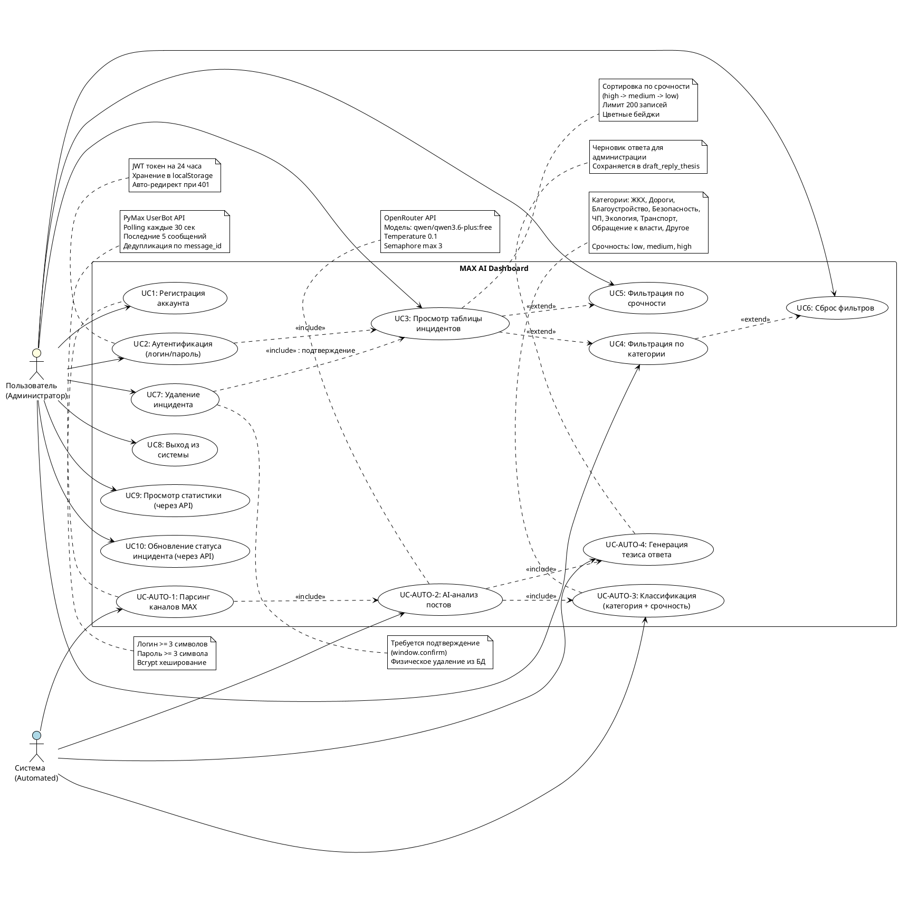

# UML Диаграммы проекта MAX AI Dashboard

---

## 1. UML Database Diagram (ER-диаграмма)

```plantuml
@startuml Database_Schema

!theme plain

entity "messages.db" as db1 {
  * messages
  --
  * id : PK, INT, AUTOINCREMENT
  * message_id : INT
  * channel_id : INT
  * channel_name : TEXT
  * text : TEXT (NULL)
  * link : TEXT
  * timestamp : INT (unix)
  * date : TEXT (ISO)
  --
  UNIQUE(message_id, channel_id)
}

entity "analytics.db" as db2 {
  * actionable_posts
  --
  * id : PK, INT, AUTOINCREMENT
  * message_id : INT
  * channel_id : INT
  * channel_name : TEXT
  * text : TEXT (NULL)
  * link : TEXT
  * timestamp : INT (unix)
  * date : TEXT (ISO)
  * requires_response : INT (0/1)
  * category : TEXT (enum)
  * urgency : TEXT (low/medium/high)
  * reason : TEXT
  * draft_reply_thesis : TEXT (NULL)
  * ai_raw_response : TEXT (JSON)
  * analyzed_at : TEXT (ISO)
  * status : TEXT (new/in_progress/resolved/ignored)
  --
  UNIQUE(message_id, channel_id)
  INDEX idx_urgency (urgency)
  INDEX idx_status (status)
  INDEX idx_date (date)
  INDEX idx_actionable_category (category)
}

entity "analytics.db" as db3 {
  * dashboard_users
  --
  * id : PK, INT, AUTOINCREMENT
  * username : TEXT (UNIQUE)
  * password : TEXT (bcrypt hash)
  * role : TEXT (default 'admin')
  * created_at : TEXT (default now)
}

db1 .u.-right-> db2 : "message_id +\nchannel_id reference"
db3 .. db2 : "shared DB file"

note top of db1
  Заполняется парсером (Parser/comment_parser.py)
  Каждая 30 сек polling -> INSERT OR IGNORE
end note

note top of db2
  Заполняется AI-сервером (AI/analytics_server.py)
  Webhook от парсера -> LLM анализ -> INSERT
  Используется FastAPI + Express (shared access, WAL mode)
end note

note top of db3
  Управляется Dashboard Server (Express)
  Seed: admin/admin (bcrypt)
  JWT аутентификация
end note

@enduml
```

---

## 2. UML Component/Logic Diagram (Логика работы программы)

```plantuml
@startuml Component_Logic

!theme plain

skinparam componentStyle rectangle

package "MAX MESSENGER" as MAX #LightBlue
package "PARSER (Python)" as Parser #LightYellow
package "AI SERVER (FastAPI)" as AI #LightCoral
package "DASHBOARD SERVER (Express)" as DashboardServer #LightGreen
package "DASHBOARD CLIENT (React)" as DashboardClient #LightSteelBlue

MAX -right-> Parser : PyMax API\npolling каждые 30сек
Parser -down-> AI : POST /webhook/post\n(aiohttp, 2 retry)
AI -right-> DashboardServer : Shared analytics.db\n(WAL mode)
DashboardServer -down-> DashboardClient : REST API\n(CORS, JWT auth)

component Parser {
  [UserBot Auth\n(phone)] as auth
  [Channel Resolver] as channels
  [Polling Loop\n(30s)] as poll
  [Message Fetch\n(last 5)] as fetch
  [Deduplication\n(INSERT OR IGNORE)] as dedup
  [SQLite Writer\n(messages.db)] as db_writer
  [Webhook Client\n(retry x2, 5s delay)] as webhook
  
  auth -> channels
  channels -> poll
  poll -> fetch
  fetch -> dedup
  dedup -> db_writer
  dedup -> webhook
}

component AI {
  [Webhook Endpoint\nPOST /webhook/post] as wh
  [Pydantic Validator] as validate
  [Empty Text Filter] as filter
  [LLM Client\n(OpenRouter Qwen3.6)] as llm
  [Semaphore\n(max 3 parallel)] as semaphore
  [JSON Parser] as json_parser
  [DB Writer\n(actionable_posts)] as ai_db
  [Stats Endpoint\nGET /stats] as stats
  [CRUD Endpoints\nGET/PATCH /actionable/:id] as crud
  
  wh -> validate
  validate -> filter
  filter -> semaphore
  semaphore -> llm
  llm -> json_parser
  json_parser -> ai_db
  
  stats .. ai_db
  crud .. ai_db
}

component DashboardServer {
  [Auth Routes\n/register, /login] as auth_routes
  [JWT Middleware] as jwt
  [Post Routes\nGET /posts, DELETE /posts/:id] as post_routes
  [SQLite Access\n(better-sqlite3)] as express_db
  [Bcrypt Hasher] as bcrypt
  [JWT Signer\n(24h expiry)] as jwt_sign
  [Seed Admin\nadmin/admin] as seed
  
  auth_routes -> bcrypt
  auth_routes -> jwt_sign
  auth_routes -> seed
  post_routes -> jwt
  post_routes -> express_db
}

component DashboardClient {
  [Login Page] as login
  [Register Page] as register
  [Dashboard Page\n(table + filters)] as dashboard
  [AuthContext\n(localStorage + JWT)] as auth_ctx
  [API Client\n(Axios interceptors)] as api
  [Protected Route\n(guard)] as guard
  
  login -> auth_ctx
  register -> auth_ctx
  auth_ctx -> api
  guard -> auth_ctx
  dashboard -> api
}

note bottom of Parser
  messages.db -> webhook -> AI Server
  Fail-safe: при ошибке AI парсер НЕ падает
end note

note bottom of AI
  LLM: qwen/qwen3.6-plus:free
  temp=0.1, max_tokens=500
  Rate limit 429 -> skip post
end note

note bottom of DashboardServer
  CORS enabled
  Limit 200 posts
  Sort by urgency (high first)
end note

note bottom of DashboardClient
  Vite proxy /api -> :5000
  Color badges: high=red, med=yellow, low=green
end note

@enduml
```



---

## 3. UML Use Case Diagram (Действия пользователя)



---

## Краткое описание диаграмм

### 1. Database Diagram
Проект использует **2 SQLite базы**:
- **messages.db** — сырые сообщения из парсера (8 полей, уникальная пара message_id+channel_id)
- **analytics.db** — общая база для AI-сервера и Dashboard (3 таблицы: actionable_posts с индексами + dashboard_users для JWT-аутентификации)
- Связь между таблицами логическая (через message_id/channel_id), foreign key не используются
- WAL mode включён для безопасного конкурентного доступа двух серверов к одной БД

### 2. Logic Diagram
**4 основных компонента** с чётким разделением ответственности:
- **Parser** — polling MAX каждые 30 сек, дедупликация, сохранение в messages.db, webhook в AI
- **AI Server** — валидация, LLM-анализ (OpenRouter Qwen), semaphore rate limiting, сохранение actionable posts
- **Dashboard Server** — JWT auth, CRUD API для постов, bcrypt хеширование, seed admin
- **Dashboard Client** — React UI с фильтрами, цветовыми бейджами, axios interceptors, protected routes

### 3. Use Case Diagram
**10 пользовательских действий** + **4 автоматических**:
- Пользователь: регистрация, логин, просмотр инцидентов, фильтрация (категория/срочность), удаление, выход, статистика (API), обновление статуса (API)
- Система: парсинг каналов, AI-анализ, классификация (9 категорий × 3 уровня срочности), генерация тезисов ответов
